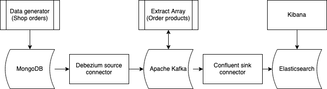

# Data pipeline example

Keywords:
- Data source - The source of our data, in this example it is a database but it can be a file, application, ...
- Data sink - The place in which we are writting the previously consumed and transformed data.
- Data pipeline - A combination of data sources, data transformations and data sinks.
- Change Data Capture (CDC) - A process that captures changes made in a database and ensures their replication.
- Connectors - Applications using the Kafka Connect API that are used to integrate new data sources and data sinks.

Recommended to read:
- [improvado.io - What Is A Data Pipeline?](https://improvado.io/blog/what-is-a-data-pipeline)
- [hvr-software.com - Four Methods of Change Data Capture](https://www.hvr-software.com/blog/change-data-capture/)
- [kafka.apache.org - Kafka Intro](https://kafka.apache.org/intro)
- [opensource.com - What is Docker?](https://opensource.com/resources/what-docker)

We will go through an example data pipeline which consists of:
- Data source (MongoDB)
- Streaming platform (Kafka ecosystem)
- Data sink (Elasticsearch).

The idea is to show how easy it is to setup a data pipeline from one database to another using open source components and a little custom code. In the end we will have a near real time setup where our data will we visible in Elasticsearch a little after it was written in MongoDB. This setup is possibly an overkill for a case where you have only one data source and data sink but it is easily scalable to support a lot of them.

This is the path that our data will take:

`Data generator -> MongoDB -> Source connector -> Kafka -> Sink connector -> Elasticsearch`



The `Source connector -> Kafka -> Sink connector` part is the most important part of this setup. The source connector is an application reading the data from MongoDB using the CDC approach and writting it to Kafka. While the data is in Kafka we will modify it using an additional application which is described later and then write it in Elasticsearch using a sink connector.

The demo setup is divided in 4 directories.

- `docker-setup`: Setup of main components needed for this setup and those are Kafka Broker, Zookeeper, Schema Registry, Kafka Connect, MongoDB, Elasticsearch, Kibana, Schema Registry UI, Kafka Manager and Kafka Connect UI. The components and their use are described in the docker-setup README.md.
- `source-data-generator`: The data generator applications that will be used to produce example data in our source MongoDB database. Simulates orders made in a shop, where one order has multiple products in it. Described in more details in the source-data-generator README.md.
- `consumer-producer-extract-array`: Application that consumes `order` messages from Kafka and extracts the products from the `products` array to a new message each. The application is using Kafka Consumer and Producer APIs. Described in more details in the consumer-producer-extract-array README.md.
- `misc`: The directory containing Avro schemas for the topic created by `consumer-producer-extract-array`, and the configs for Source and Sink connectors. README.md is provided in the directory, and the deploy_schemas.sh script.

---

## Requirements

* Docker (See [Get Docker](https://docs.docker.com/get-docker/))
* Python (See [Downloading Python](https://wiki.python.org/moin/BeginnersGuide/Download))

---

## Deployment steps

1. Deploy the main components using Docker

     The main components of the demo setup which were listed above will be deployed using Docker containers. The `docker-compose.yaml` file that will be used for this can be found in the `docker-setup` directory. For more details check the `docker-setup` directory README.md.

      - Create the Docker network that is used in the docker-compose:

        `docker network create demo_network`
      - Start the containers by running the following command inside the `docker-setup` directory:

        `docker-compose up`


    The applications are exposed on following ports:
    - MongoDB: localhost:27017
    - Kafka Broker: localhost:9092
    - Zookeeper: localhost:2181
    - Schema Registry: localhost:8081
    - Kafka Connect: localhost:8083
    - Schema Registry UI : localhost:8001
    - Kafka Connect UI: localhost:8082
    - Kafka Manager: localhost:8003
    - Kibana: localhost:5601
    - Elasticsearch: localhost:9200 and localhost:9300


2. Prepare the MongoDB and deploy the Source Connector


     1. We will use the [Debezium MongoDB Source connector](https://debezium.io/docs/connectors/mongodb/). For us to use it our MongoDB needs to be set up as a replica set. We need to do the following:
        - Connect to the MongoDB container shell:

          `docker exec -it demo-mongodb bash`

        - Connect to the mongo shell:

          `mongo -u admin -p admin --authenticationDatabase admin`

        - Initate the replica set:

          `rs.initiate();`

      1. Generate the source data using the `source-data-generator`:
         - Run the following command inside the `source-data-generator` directory to install required packages:

           `pip3 install -r requirements.txt`

         - Generate helper collections:

           `python3 generate-helper-collections.py --host localhost --port 27017 --database demoShop  --user admin --password admin -a admin`
         - Generate orders:

           `python3 generate-orders.py --host localhost --port 27017 --database demoShop  --user admin --password admin -a admin --number 100 --days 1`

          `Note`: For more details check the `source-data-generator` directory README.md.

      2. Deploy the source connector that will write the changes on the orders to the `demoShop.demoShop.orders` topic:

          ```
          curl -X POST \
          http://localhost:8083/connectors \
          -H 'Content-Type: application/json' \
          -H 'cache-control: no-cache' \
          -d '{
            "name": "demo-debezium-source-connector_v1",
            "config": {
              "connector.class": "io.debezium.connector.mongodb.MongoDbConnector",
              "mongodb.hosts": "demoReplica/demo-mongodb:27017",
              "mongodb.user": "admin",
              "mongodb.password": "admin",
              "mongodb.name": "demoShop",
              "database.whitelist": "demoShop",
              "collection.whitelist": "demoShop.orders",
              "mongodb.members.auto.discover": "false",
              "transforms": "unwrap",
              "transforms.unwrap.type": "io.debezium.connector.mongodb.transforms.ExtractNewDocumentState",
              "transforms.unwrap.drop.tombstones": false,
              "transforms.unwrap.operation.header": true
            }
          }'
          ```
          `Note`: For more details check the Debezium connector documentation linked in the first step.

3. Prepare and deploy the `consumer-producer-extract-array` application

   1. Before we run the application we need to deploy the schemas it will use for the messages it produces. To deploy the schemas run the following command inside the `misc` directory:

        `bash deploy_schemas.sh`

        `Note`: If interested, you can see the schemas in the `./misc/schemas` directory.

   2. Build the application Docker image by running the following command inside the `consumer-producer-extract-array` directory:

      `docker build -t demo/cp_extract_array:0.0.1 .`

   3. Run the application by running the following command inside the `consumer-producer-extract-array` directory:

      `docker-compose up`

      The application will write to the console the number of messages it processes.

    `Note`: Application and its usage is described in more details in the `consumer-producer-extract-array` directory README.md.


4. Deploy the sink connector to Elasticsearch

   The connector will write the messages from the `demoShop.demoShop.orderProducts` topic to Elasticsearch.
    ```
    curl -X POST \
      http://localhost:8083/connectors \
      -H 'Content-Type: application/json' \
      -H 'Postman-Token: 3da0f046-b5df-457a-a8d1-33eb8f67fa88' \
      -H 'cache-control: no-cache' \
      -d '  {
        "name": "demo-elasticsearch-sink-connector_v1",
        "config":   {
            "connector.class": "io.confluent.connect.elasticsearch.ElasticsearchSinkConnector",
            "tasks.max": "1",
            "topics": "demoShop.demoShop.orderProducts",
            "name": "demo-elasticsearch-sink-connector_v1",
            "connection.url": "http://elasticsearch:9200",
            "type.name": "_doc",
            "transforms": "extractKey",
            "transforms.extractKey.type":"org.apache.kafka.connect.transforms.ExtractField$Key",
            "transforms.extractKey.field":"id"
          }
      }'
    ```
      `Note`: For more details check the [Elasticsearch sink connector documentation](https://docs.confluent.io/current/connect/kafka-connect-elasticsearch/index.html).

5. Discover the data on Kibana:

   - Open Kibana in your browser on http://localhost:5601
   - Go to Management -> Index Patterns
     - Create an index pattern `demoshop.demoshop.orderproducts`
     - On the next step as a `Time Filter field name` select `order_ts` and Create the pattern
     - Now you can see the order products on the Discover tab and filter them by time.

   Note: If you want now you can create new visualizations on the Visualize tab. Run the data generator again to see the new data arriving.
